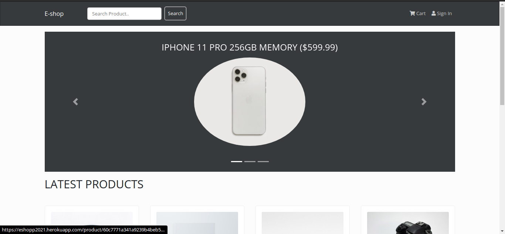
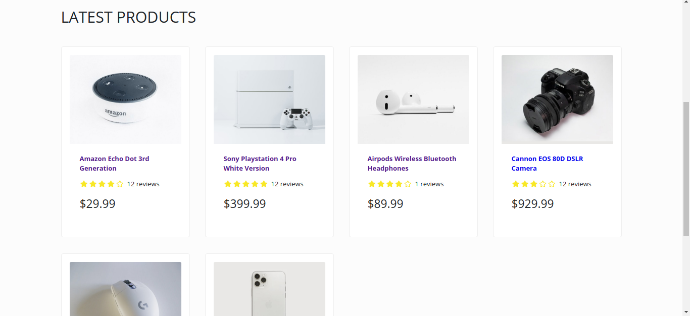
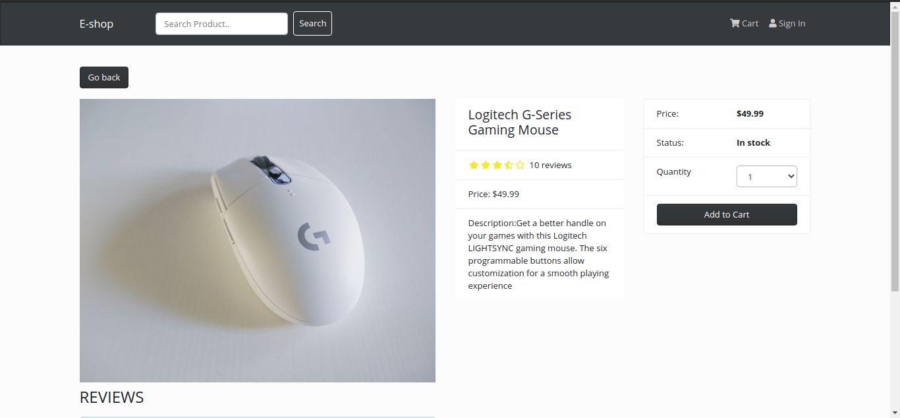

# eshop-ecommerce-app

<ol>
  <li>User can see any products</li>
  <li>User can sign in and signup </li>
  <li>User can purchase any product by using paypal sandbox account</li>
  <li>User can review products </li>
  <li>Admin can add/remove products</li>
  <li>Admin can mark orders as <strong>delivered</strong></li>
</ol>
<h3> Live preview is deployed on heroku <a href="https://eshopp2021.herokuapp.com/">Click here</a></h3>
<h6> Please use email: <strong>sb-5j5yp6457479@personal.example.com</strong> password: <strong>123456</strong> for payment testing.</h6>
